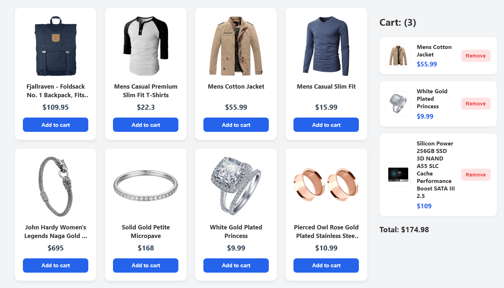

# 🌐 [Demo havolasi](#)

# Mini Marketplace

Kichik SPA-ilova bo‘lib, mahsulotlar ro‘yxatini ko‘rsatadi, foydalanuvchi mahsulotni savatga qo‘shishi va o‘chirishi mumkin.

## 🚀 Texnologiyalar

- **HTML + CSS** — UI tuzilishi
- **JavaScript (Vanilla JS)** — API’dan ma’lumot olish va mahsulotlar ro‘yxatini ko‘rsatish
- **React** — Savat funksionalligini boshqarish
- **LocalStorage** — Savatni saqlash
- **FakeStore API** — Mahsulotlar manbasi

## 📦 Loyihaning vazifalari

### Products (Vanilla JS)

- Mahsulotlar ro‘yxatini ko‘rish
- API orqali ma’lumot yuklash
- “Add to Cart” tugmasi

### Cart (React)

- Mahsulot qo‘shish
- Mahsulotni o‘chirish
- Mahsulotlar sonini ko‘rsatish
- Umumiy summani hisoblash

## 📁 Loyiha strukturasi

```text
mini-marketplace/
│── index.html
│── css/
│   └── style.css
│── js/
│   └── products.js
│── react-app/
│   ├── index.html
│   ├── src/
│   │   ├── main.jsx
│   │   ├── App.jsx
│   │   └── components/
│   │       ├── CartList.jsx
│   │       └── CartItem.jsx
│   └── ...
```

## 📷 Skrinshot



## ⏳ Vaqt sarfi

- 1.5-2 soat (dizayn, funksiya, React qismi va sinov)

## ⚠️ Qiyin bo‘lgan joylar

- **Vanilla JS → React o‘zaro aloqasi**
